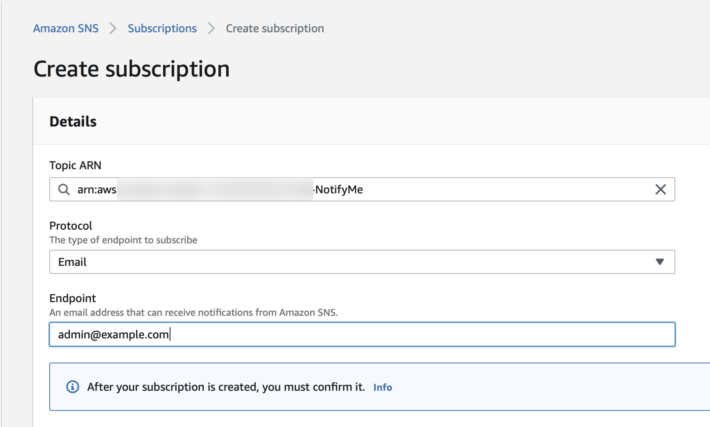
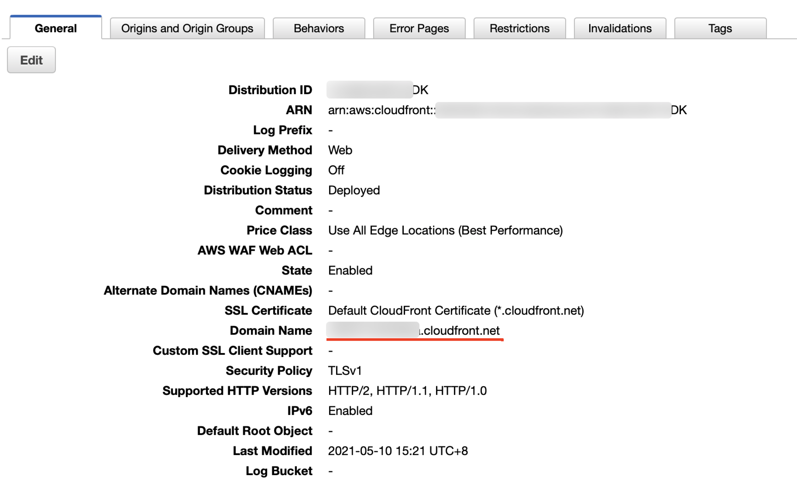

# Deploy-about-Smart-Cutting

本方案采用如下架构：  


如希望了解架构设计的整体思路，请参考 [架构说明]() 章节；如希望了解本方案的使用说明，请参考 [使用说明]() 章节。

## 资源总体说明
本方案共需部署以下资源：

序号 | 资源类型 | 资源名称 
----|------|------
1 | SNS Topic | NotifyMe
2 | S3 Bucket | \<YOUR\_BUCKET\_NAME>
3 | CloudFront Distribution | 
4 | DynamoDB Table | sc-faces-collection 
5 | DynamoDB Table | sc-faces-search 
6 | IAM Role | scRole 
7 | Lambda Function | sc-01-collection-create
8 | Lambda Function | sc-02-faces-search
9 | Lambda Function | sc-03-result-save
10 | Lambda Function | sc-04-video-clip
11 | Lambda Function | sc-05-notify
11 | API Gateway | smart-cutting


## 环境准备
部署说明中的命令参考 [AWS CLI Version 2 命令规范](https://awscli.amazonaws.com/v2/documentation/api/latest/reference/index.html#cli-aws)，需要根据 [官方文档](https://docs.aws.amazon.com/zh_cn/cli/latest/userguide/install-cliv2.html) 提前安装好 AWS CLI version 2 工具，并配置好拥有 Admin Account 中 **管理员权限** 的 AKSK。如您已经安装 AWS CLI Version 1，可对应本方案参考 [AWS CLI Version 1 命令规范](https://docs.aws.amazon.com/cli/latest/reference/)，本方案对可能存在的命令差异不再做进一步说明。

将本方案代码克隆到本地：

```
git clone  https://github.com/weiping-bj/SCP-Workaround-in-AWS-ChinaRegions.git
```

进入方案目录：

```
cd AWS-AI-Services-in-Media-Industry/smart-cutting
```

设置部署时需要用到的常量，```ACCOUNT_ID``` 和 ```BUCKET_NAME```：

```
ACCOUNT_ID=`aws sts get-caller-identity |jq -r ".Account"`

BUCKET_NAME=sc-poc-$ACCOUNT_ID
```

>如未安装 [jq](https://stedolan.github.io/jq/download/) 工具，也可以手工设置 ACCOUNT_ID

## 资源部署
### SNS Topic
创建 SNS 主题：

```
TOPIC_ARN=`aws sns create-topic --name NotifyMe --region us-east-1 | jq -r ".TopicArn"`
```
创建成功后，返回 SNS Topic 的 ARN。

通过 AWS 控制台选择 ```Amazon SNS > 订阅 > 创建订阅```，输入网络管理员邮件地址，如下图：  


需要通过管理员的邮箱确认上述订阅。

### S3 Bucket

创建 S3 Bucket：

```
aws s3api create-bucket --bucket $BUCKET_NAME \
--region us-east-1
```

创建成功后，返回 S3 Bucket 的 ARN。在 S3 Bucket  中创建 3 个目录。目录名称及作用说明如下：

- **faces/**：用于保存需要识别的人物头像照片。

```
aws s3api put-object --bucket $BUCKET_NAME \
--key faces/
```

- **input/**：用于保存需要处理的视频文件。

```
aws s3api put-object --bucket $BUCKET_NAME \
--key input/
```

- **faces-search/**：用于保存人脸识别的结果信息。

```
aws s3api put-object --bucket $BUCKET_NAME \
--key faces-search/
```

- **job-template/**：用于保存创建 MediaConvert 作业时需要用到的作业模板。

```
aws s3api put-object --bucket $BUCKET_NAME \
--key job-template/
```

将本方案中提供的作业模板上传到新创建的目录下：

```
aws s3 cp resources/job-template.json s3://$BUCKET_NAME/job-template/
```

- **output/**：用于保存截取后的视频文件。

```
aws s3api put-object --bucket $BUCKET_NAME \
--key output/
```

### CloudFront Distribution

登录 AWS 控制台进入 CloudFront 界面，进入```CloudFront > 分配 > 创建分配```，在 ```源域名``` 处输入之前创建的 S3 存储桶名称（可以从下拉菜单中获取），```源路径``` 处输入 ```output/```。

为提升数据安全性，设置 S3 中内容仅可以通过 CloudFront 访问，参考如下设置：

- 限制存储桶访问：是
- 源访问身份：创建新身份
- 注视：保持默认值即可
- 授予对存储桶的读取权限：是，更新存储桶策略

其它参数保持默认，如下图：  


从 AWS 控制台中进入到刚刚创建的分配，在 ```常规``` 标签下查看该分配的域名：  


将分配的域名设置为系统变量：

```
DIS_DOMAIN=xxxxxxx.cloudfront.net
```

### DynamoDB Table
#### sc-faces-collection
当使用 Amazon Rekognition 服务进行人脸检测时，需要先建立关于人脸信息的 collection，但 collection 本身保存的元数据信息不利于查询。这里创建一个 DynamoDB Table，用于记录 collection 的部分原数据信息，包括：人脸数量、人脸名称、所使用的人脸照片所保存的位置，示例如下图：  


通过控制台，```DynamoDB > 表 > 创建表```，表的名称为 ```sc-faces-collection```：  


#### sc-faces-search
用于记录搜索时的一些状态信息，包括 jobId、使用了哪个 collection、中间过程的 json 文件保存的位置、生成视频的保存位置等，示例如下图：  


通过控制台，```DynamoDB > 表 > 创建表```，表的名称为 ```sc-faces-search```：  


### IAM Role
为本方案中的 5 个 Lambda 函数创建一个统一的 IAM Role。
>您还可以根据需要进一步缩小权限，为每个 Lambda 函数创建独立的 IAM Role。

通过控制台，```IAM > 角色 > 创建角色```，选择为 Lambda 创建角色：  


在 ```Attach 权限策略``` 步骤中，选择以下 6 个托管策略：  

- AmazonS3FullAccess
- AmazonDynamoDBFullAccess
- AmazonRekognitionFullAccess
- AmazonSNSFullAccess
- AWSElementalMediaConvertFullAccess
- CloudWatchLogsFullAccess

将角色命名为 ```scRole```。

### Lambda Function


[返回 README](../README.md)

